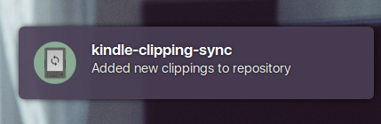

#  kindle-clipping-sync

Checks for a kindle mount event and commits clippings to a git repository. Tested on a Kindle 3 (keyboard). Works on Linux.




## Usage

```
$ kindle-clipping-sync --repo-path /path/to/repo/.git
```

When a kindle is mounted, clippings will be copied over to `/path/to/repo/<serialNumber>/clippings.txt` and committed if there are changes.

## Building

Requires

* node `>= 4.0.0`
* npm
* gulp

To install dependencies run `npm install`
To build run `gulp build`, the app will be in the `lib/` folder
